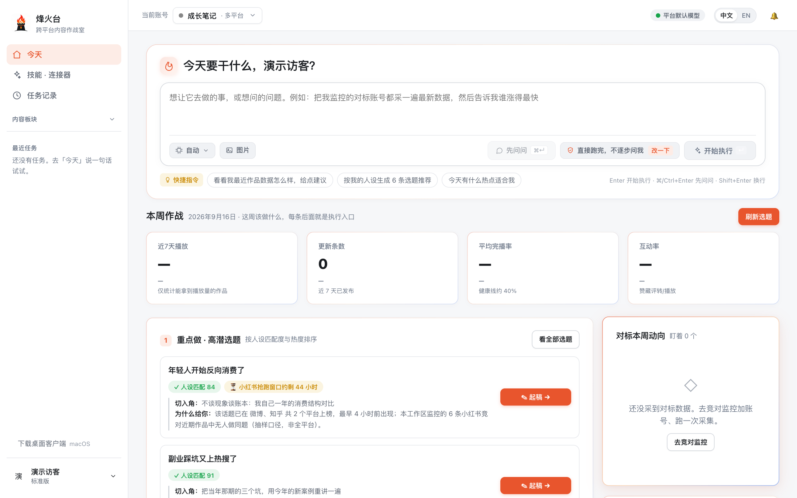
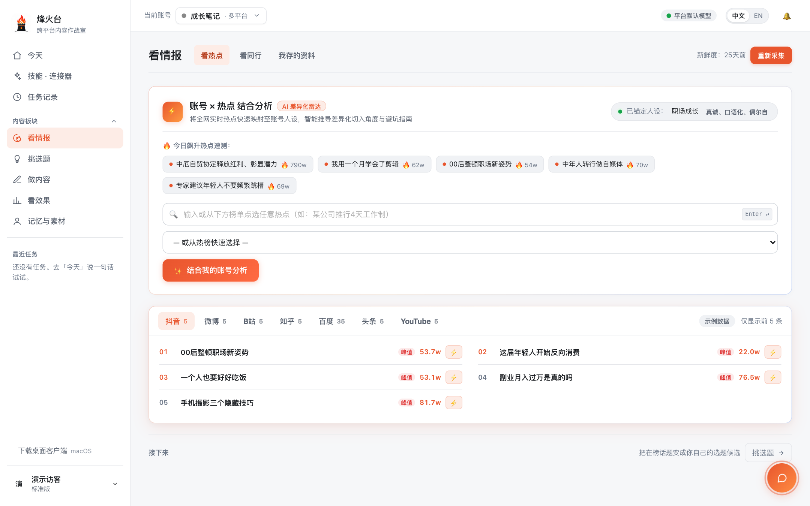
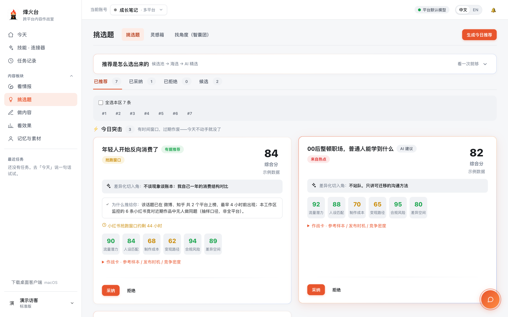
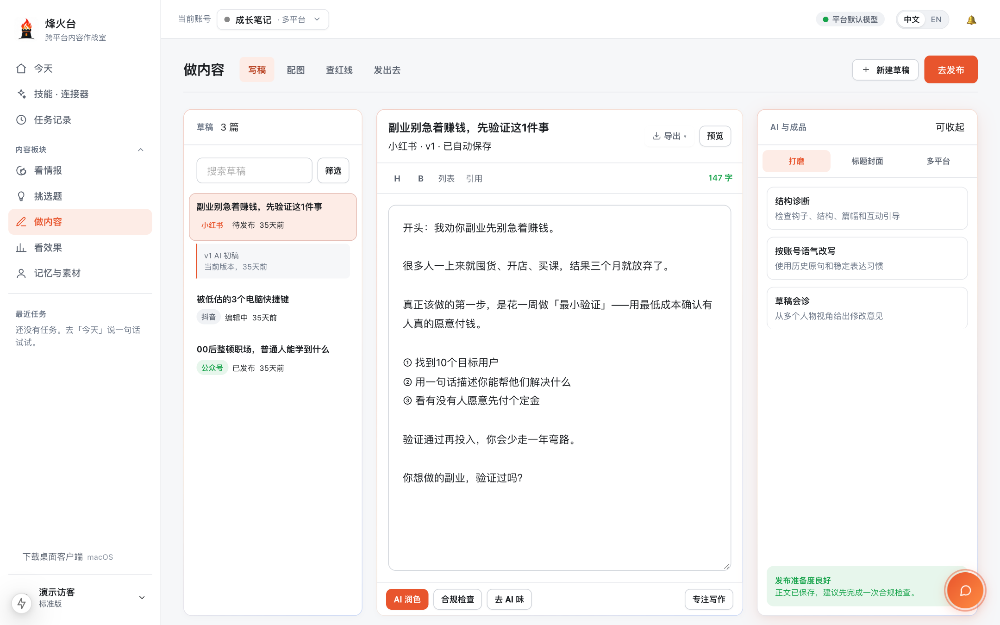
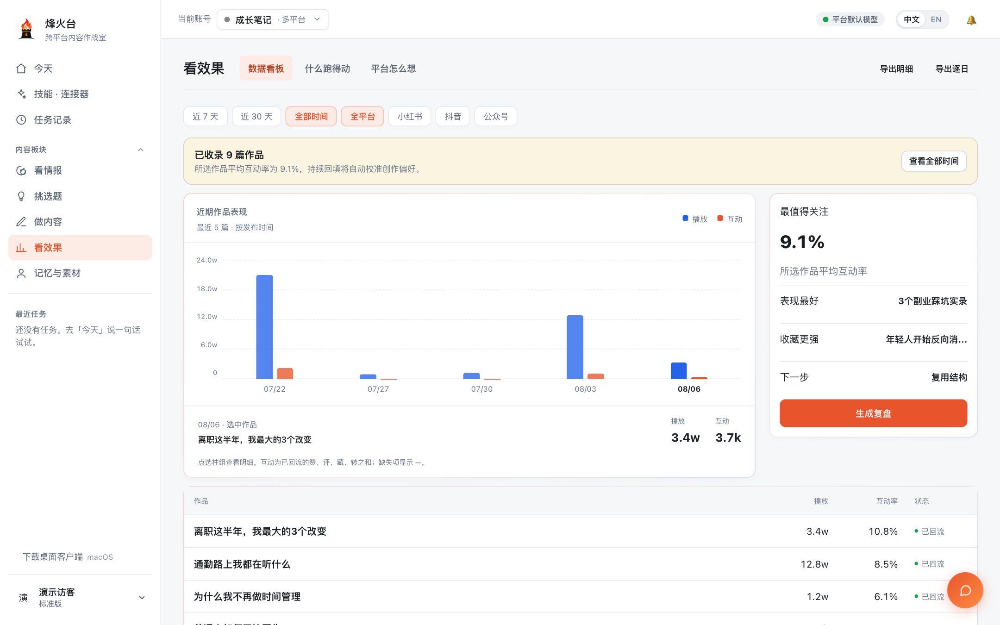
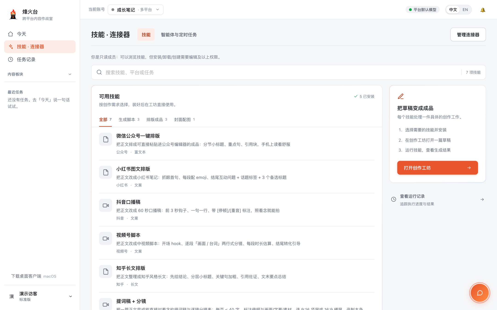

[中文](README.md) · 🌐 English

<h1 align="center">Beacon</h1>

<p align="center"><b>Know what to make before you write.</b></p>

<p align="center">For creators who publish every week: a daily topic brief with reasons, across Douyin, Xiaohongshu, WeChat, Bilibili and Channels.</p>

<p align="center">
  <a href="https://beacon.iyunci.cn">👉 Live Demo</a>
</p>

<p align="center">
  <a href="https://github.com/AiyaFun/beacon"></a>
  <a href="LICENSE"></a>
  <a href="https://beacon.iyunci.cn"></a>
  <a href="https://nodejs.org"></a>
</p>

<p align="center">
  A multi-platform content planning SaaS for creators and content teams.<br>
  Trending Aggregation · Competitor Monitoring · AI Topic Advisory · Multi-Platform Rewriting · Compliance Check · Analytics Dashboard.
</p>

<p align="center">
  Maintainer: <a href="https://github.com/AiyaFun">AiyaFun</a>
</p>

<p align="center">
  <a href="#download--install">Download</a> ·
  <a href="#what-problem-does-it-solve">What It Solves</a> ·
  <a href="#how-beacon-compares-to-openclaw-and-hermes-agent">vs OpenClaw / Hermes</a> ·
  <a href="#not-supported-yet--in-progress">Not Supported Yet</a> ·
  <a href="#who-is-it-for">Who It's For</a> ·
  <a href="#quick-start">Quick Start</a> ·
  <a href="#production-deployment">Deployment</a> ·
  <a href="#tech-stack">Tech Stack</a> ·
  <a href="#license">License</a>
</p>

---

## Screenshots

<table>
  <tr>
    <td width="50%" valign="top"><b>Today</b> · Dispatch work in one sentence; every high-potential topic in the weekly battle report has a "Draft" button right next to it<br><br></td>
    <td width="50%" valign="top"><b>Intel</b> · Trending lists from seven sources, plus an account × trend differentiation radar<br><br></td>
  </tr>
  <tr>
    <td width="50%" valign="top"><b>Topics</b> · Each recommendation comes with a six-dimension score, a differentiated angle, a head-start window and "why this is for you"<br><br></td>
    <td width="50%" valign="top"><b>Studio</b> · Drafts follow the topic plan and the platform format, get de-AI'd automatically, and adapt to multiple platforms<br><br></td>
  </tr>
  <tr>
    <td width="50%" valign="top"><b>Performance</b> · Post metrics flow back; views and engagement at a glance, one-click retrospective<br><br></td>
    <td width="50%" valign="top"><b>Skills · Connectors</b> · Ready-made skills for WeChat layout, Xiaohongshu notes, Douyin scripts and more<br><br></td>
  </tr>
</table>

<p align="center"><sub>Screenshots are from the demo workspace (sample data).</sub></p>


## Download & Install

Three ways to use Beacon — pick what fits:

| Option | Best for | How to get it |
|---|---|---|
| **Online** | Try it out | Open [beacon.iyunci.cn](https://beacon.iyunci.cn) |
| **Desktop client** | Existing users who need local browser automation | Download the installer below 👇 |
| **Appliance** | Run the whole system on your own machine, data stays local | Clone the repo, one command to install 👇 |

### Desktop Client

The desktop client is a browser companion for the online version — it uses your local Chrome for data collection and auto-backfill.

Download from [Releases](https://github.com/AiyaFun/beacon/releases):

| Platform | File | Notes |
|---|---|---|
| **macOS** (Apple Silicon) | `烽火台_x.x.x_aarch64.dmg` | Open DMG → drag to Applications |
| **Windows** (x64) | `烽火台_x.x.x_x64-setup.exe` | Run the setup wizard |

Sign in with your online account after installation. The client checks for updates automatically.

### Appliance (Self-Hosted)

Runs entirely on your own machine with a local SQLite database. No server, no Docker required.

```bash
git clone https://github.com/AiyaFun/beacon.git
cd beacon
bash deploy/appliance/install.sh    # macOS / Linux
```

On Windows, use PowerShell:

```powershell
powershell -ExecutionPolicy Bypass -File deploy\appliance\install.ps1
```

The install script handles everything: checks Node.js → generates config → installs dependencies → creates database → builds → registers auto-start → opens the setup wizard.

To update:

```bash
git pull
bash deploy/appliance/update.sh
```


## What Problem Does It Solve

Creators face three daily challenges: **What's trending? What are competitors doing? How to write fast while staying compliant?**

Beacon brings all three into one platform so you don't have to juggle a dozen apps.

| Feature | Description |
|---|---|
| **Trending Aggregation** | Real-time trending topics from Weibo, Douyin (TikTok CN), Bilibili, Zhihu, Baidu, YouTube, etc. with AI-powered clustering and deduplication |
| **Competitor Monitoring** | Cross-platform competitor tracking (Douyin, Xiaohongshu, Bilibili, YouTube, X, TikTok) with automatic content scraping and analytics. **For WeChat Official Accounts / Channels see "Not Supported Yet" below** |
| **Topic Engine** | A panel of 12 AI personas reviews topics from different angles, tailored to your creator profile |
| **Writing Workshop** | AI-assisted drafting, one-click multi-platform rewriting, humanness scoring, fact-drift detection, automatic AIGC labeling |
| **Compliance Check** | 4-tier sensitive word library with per-platform rules — scan before you publish |
| **Browser Extension** | One-click inspiration clipping, self-account data sync, competitor content collection (the open-source build **never touches the WeChat Official Account back office** — see "Not Supported Yet") |
| **Bot Integration** | Feishu (Lark) group bot for trending alerts and natural language queries |
| **Analytics Dashboard** | Unified multi-account dashboard with trend analysis and weekly reports |
| **One-Click Publishing** | WeChat Official Accounts go through the official API (drafts only by default); for Douyin / Xiaohongshu / Bilibili / WeChat Channels the extension fills the back-office form and **stops before the publish button** — you press it |
| **AI Assistant & Agent** | An assistant reachable from every page; switch on "execute" and it can create drafts, add competitors and so on — **every write and every paid call is confirmed step by step** |
| **Workflow Templates** | Chain multi-step routines (topic → draft → rewrite → compliance) into a template; install one, run it, and every step reports its own result |
| **AI Covers & Illustrations** | Covers at each platform's aspect ratio (16 structured styles plus your own portrait library); in-article illustrations never carry text. Both explicit and embedded AIGC markers |
| **Reader Voice** | Collects comments on your own posts and on competitors', feeding them back as topic evidence and gap analysis |
| **Growth Tracking** | Daily follower/engagement snapshots and trends for your accounts and for competitors — a metric a platform does not expose stays blank instead of being recorded as 0 |

## How Beacon Compares to OpenClaw and Hermes Agent

Beacon also ships agents, skills, memory, scheduled jobs and chat bots, so it is often compared with
[OpenClaw](https://github.com/openclaw/openclaw) and [Hermes Agent](https://github.com/NousResearch/hermes-agent).

In one sentence: **those two are general-purpose agent runtimes; Beacon is a vertical product for content
operations.** They give you an assistant that can do anything you describe. Beacon gives you one pipeline out of
the box — trending topics, competitors, topic selection, drafting, compliance, publishing, review — and the agent
is only one layer of it. They are not substitutes: Beacon ships an MCP server, so either of them can call it as a
tool (see the end of this section).

### What they have in common

- **Open source and runnable on your own machine**, with no lock-in to a single model vendor.
- **The same execution core**: a goal → call a tool → read the result → decide the next step loop, with context
  compression and a budget / round cap.
- **Skills, persistent memory, scheduled jobs and sub-tasks** — what the agent learns is kept, runs on schedule,
  and leaves a record.
- **Work can be dispatched from chat**: say one sentence in a group, the task runs in the background, and the
  result comes back to the same conversation.
- **All three can drive a browser** to read pages.

### Where they differ

| Dimension | Beacon | OpenClaw | Hermes Agent |
|---|---|---|---|
| **Positioning** | Vertical product for content operations; the agent is one layer | General-purpose personal AI assistant that runs on your own devices | General-purpose self-improving agent (Nous Research) that "grows with you" |
| **What you get out of the box** | Domain data and UI: multi-source trending lists, competitor library, six-dimension topic scoring, per-platform formats, sensitive-word library, analytics dashboard | An assistant wired to 20+ chat channels that can act on your devices; what it does depends on skills and plugins | An agent with a terminal, memory and skills; what it does depends on what you ask and what it accumulates |
| **Main entry point** | Web workspace (one dispatch box on the home page) + group bots + desktop client / browser extension | Chat channels + companion apps per OS (voice, screen, device actions) | Terminal CLI + messaging gateway |
| **Chat channels** | Mostly Chinese workplace IM: Feishu (Lark), WeCom, DingTalk, WeChat; plus Telegram and Slack | WhatsApp, Telegram, Slack, Discord, iMessage, Signal, Teams and more | Telegram, Discord, Slack, WhatsApp, Signal, email |
| **Deployment** | Multi-tenant SaaS / desktop client / appliance (local SQLite) | Self-hosted only; a local Gateway is the control plane | Self-hosted, from a small VPS to serverless; seven terminal backends (local, Docker, SSH, Modal, …) |
| **Where skills come from** | Steps are distilled only from **real execution traces**; a model may draft one, but **a human must enable it** | Skills / plugins, distributed through ClawHub | Skills are created **autonomously** after complex tasks and improved during use (closed learning loop) |
| **Memory** | Isolated per account, confidence decays over time; scanned for prompt injection on write and again before injection; declarative sentences only, no imperatives | Sessions, memory and credentials stay on your machine | Persistent memory + full-text search across sessions + user modeling |
| **Execution boundary** | Seven role bots, each with its own tool allowlist; three authorization levels; irreversible actions (publish / delete / pay / follow) **always stop and hand the click to you**; local shell exists only in the appliance build and is hard-off in SaaS | General execution within your machine's permissions (commands, browser, device actions) | General terminal execution with approval for dangerous commands |
| **What the browser is for** | Read-only collection and pre-filling publish forms: an action allowlist, no arbitrary script execution by the model; your logins stay in your own browser; no fingerprint spoofing | General browser control | General web / browser tools |
| **Models** | Any OpenAI-compatible endpoint (DeepSeek, Qwen, Kimi, GLM, MiniMax, …); the appliance build can use a ChatGPT subscription | Claude, Codex, local models and others, pluggable | Any model (Nous Portal, OpenRouter, OpenAI, custom endpoints) |
| **Stack** | TypeScript · Next.js · Prisma | TypeScript · Node.js | Python |
| **License** | AGPL-3.0 + commercial license | MIT | MIT |

### What we borrowed, and what we deliberately did not

Beacon's agent layer was written after reading both projects at source level. For the record:

- **Borrowed**: scanning memory for prompt injection before it is written; pruning old tool results (without a
  model call) before compressing context; a hard-line list of local commands that no authorization level can
  unlock; redacting secrets from command output before it enters context; catching up once on scheduled jobs
  missed during downtime (all from Hermes). Semantic extraction of page content, and role / aria / text anchors
  instead of brittle class names (from the OpenClaw school of browser tooling).
- **Deliberately not borrowed**: writing skills and memory automatically in the background — that is Hermes'
  signature feature, but Beacon's memory is carried into **every generation** and its skills operate **real
  accounts**, so the rule stays "a model may draft, a human must enable". Session / fingerprint pools — that is
  fighting platform risk control, and the cost lands on the user's account. Multiple terminal backends and
  sandboxed execution of model-written code — they have no place in a SaaS architecture.

### Which one to pick, and using them together

- You want a personal assistant you can **ask to do anything** → OpenClaw or Hermes Agent.
- You want **a reasoned topic list every morning** and the whole pipeline from topic to review → Beacon.
- Already running one of the other two: `mcp-server.ts` at the repository root exposes 7 tools (dispatch a task,
  check progress, collect competitor data, collect your own data, read a page, …), so any MCP-capable agent can
  use Beacon as its content-operations toolbox.

<sub>The descriptions of OpenClaw and Hermes Agent are based on their public READMEs and source code. Both projects
move fast — their own repositories are the source of truth.</sub>

## Not Supported Yet / In Progress

This section lists what Beacon **cannot do yet**. It exists so the feature table above does not
read as a promise: each item below either has no usable data channel, or has not been verified
against a real environment.

| Item | Status |
|---|---|
| **Competitor data for WeChat Official Accounts** | **Bring your own commercial source.** Without `BEACON_NEWRANK_KEY` there is no automated path at all (the extension route was removed); file import only |
| **Competitor data for WeChat Channels** | **Not supported.** No public profile page and no official content API — neither the server nor the extension can reach it. Subscribing yields no data, and the UI says so instead of pretending to collect |
| **Syncing your own Official Account metrics** | **Not included in the open-source build** — it is an optional module of the official build (and needs a per-site grant). Building the extension from this repository, the feature does not exist |
| **Chinese text on AI covers** | **Being tuned.** Image generation ships, but Chinese headline typography has not been calibrated style-by-style on real output |
| **TikTok comment collection** | **Not verified on a real account** (needs a login); the other five platforms are verified |
| **Off-site backup replica** | **Not configured.** Daily backups and weekly restore drills run, but the copy currently lives on the same host (set the four `BEACON_BACKUP_S3_*` variables to enable) |

## Who Is It For

- **Solo Creators** — Managing multiple platform accounts, need efficient trend tracking and content production
- **Content Teams** — MCN / brand content ops teams needing unified monitoring and collaboration
- **Social Media Managers** — Corporate social media roles needing competitor analysis and data-driven topic selection
- **Indie Developers** — Want to build your own content tools on top of this project

## Typical Workflow

```
1. Sign in → Link creator accounts (WeChat, Douyin, Xiaohongshu, etc.)
2. Home "Today's Overview": trending topics + competitor activity + AI-recommended topics
3. Tap a topic → AI advisory panel gives multi-angle entry suggestions
4. Enter "Writing Workshop" → AI draft → one-click rewrite for each platform's style
5. Run "Compliance Check" → confirm no sensitive words → copy & publish
6. Post-publish data flows back → analyze performance → inform next topic
```

## Tech Stack

| Layer | Technology |
|---|---|
| **Frontend** | Next.js 15 (App Router), React 19, TypeScript, Tailwind CSS |
| **Backend** | Next.js Server Actions + API Routes (Node.js) — no separate backend service |
| **Database** | SQLite (dev) / PostgreSQL + pgvector (prod), Prisma ORM |
| **Task Queue** | BullMQ + Redis (prod) / in-process queue (dev) |
| **LLM** | Any OpenAI-compatible endpoint (DeepSeek, Qwen, MiniMax, Kimi, GLM, etc.) |
| **Browser Extension** | Chrome Manifest V3 |
| **Containerization** | Docker Compose (Nginx + Web + Worker + Redis) |
| **Auth** | SMS OTP + WeChat OAuth (optional) |
| **Payment** | WeChat Pay Native (optional) |

## Quick Start

```bash
git clone https://github.com/AiyaFun/beacon.git
cd beacon
npm install
cp .env.example .env
npm run setup
npm run dev
```

Open [http://localhost:3000](http://localhost:3000). In development mode all external dependencies are mocked — **no API keys, no Redis, no PostgreSQL required**. Works out of the box.

## Production Deployment

### Prerequisites

| Requirement | Details |
|---|---|
| Linux Server | Ubuntu 20.04+ or CentOS 7+ |
| Docker & Compose v2 | Container orchestration |
| Domain + DNS | Pointed to your server |
| SSL Certificate | Let's Encrypt or your own |
| PostgreSQL 15+ | pgvector extension required (self-hosted or managed) |

### Step 1: Configuration

```bash
git clone https://github.com/AiyaFun/beacon.git
cd beacon
cp .env.production.example .env.production
chmod 600 .env.production
```

Edit `.env.production`. Every variable has detailed comments. Required variables:

| Variable | Purpose |
|---|---|
| `DATABASE_URL` | PostgreSQL connection string with `?schema=beacon` |
| `BEACON_MASTER_KEY` | Encryption master key. Generate: `openssl rand -base64 48` |
| `BEACON_SMS_VENDOR` | SMS provider, set to `"volcengine"` |
| `BEACON_VOLC_SMS_AK/SK` | VolcEngine SMS AccessKey |
| `BEACON_DEFAULT_LLM_*` | LLM endpoint + API key |
| `BEACON_TRUSTED_PROXY_HOPS` | Reverse proxy layers, default `"1"` |

### Optional Features

These are not required for core functionality:

| Feature | Variables | Without It |
|---|---|---|
| **WeChat OAuth** | `BEACON_WECHAT_APPID` + `SECRET` | SMS-only login |
| **WeChat Pay** | `BEACON_PAY_VENDOR="wxpay"` + merchant keys | Paid features unavailable |
| **Competitor Data** | `BEACON_TIKHUB_KEY`, `BEACON_YOUTUBE_API_KEY`, `BEACON_NEWRANK_KEY`, etc. | No server-side source for that platform: the ones the extension can reach (Douyin / Xiaohongshu / Bilibili / YouTube / X / TikTok) are collected in your own browser instead; **WeChat Official Accounts and Channels have no automated path at all** and the UI says "source not enabled" |
| **Vector Embeddings** | `BEACON_EMBED_*` | Falls back to keyword matching |
| **Feishu Bot** | Configure in `/settings` | No push notifications |
| **Sentry** | `BEACON_SENTRY_DSN` | Local logs only |

### Step 2: Initialize Database

```bash
export REDIS_PASSWORD="$(openssl rand -hex 32)"
DATABASE_URL="your-connection-string" bash scripts/db-init-supabase.sh
```

### Step 3: Launch

```bash
docker compose up -d --build
```

| Service | Role |
|---|---|
| **proxy** | Nginx reverse proxy (public ports 80/443) |
| **web** | Next.js application (internal only) |
| **worker** | BullMQ background tasks |
| **redis** | Queue + rate limiting |

### Step 4: Verify

```bash
docker compose ps
curl -s https://your-domain.com/api/health | jq .
```

### Updating

```bash
git pull
docker compose up -d --build redis web worker
```

## Browser Extension

1. Open `chrome://extensions/`
2. Enable "Developer mode"
3. Click "Load unpacked" → select the `extension/` directory

## Security & Compliance

### Security Measures

This project implements multiple layers of security protection:

| Layer | Mechanism |
|---|---|
| **Secret Isolation** | All secrets, API keys, and server IPs are injected via `.env.production`, never in source code |
| **Clean Git History** | Open-source branch is an orphan branch — no secrets or internal configs in history |
| **Pre-commit Hook** | Scans for 10 secret patterns (SK-/AKIA/AKLT/PEM/password assignments/connection strings/AppIDs, etc.) and blocks commits |
| **GitHub Push Protection** | Repository-level secret scanning blocks known secret formats on push |
| **Row Level Security** | PostgreSQL RLS enabled on all tables — tenant data is physically isolated |
| **Reverse Proxy Lockdown** | Production web port binds to 127.0.0.1 only; only Nginx exposes ports 80/443 |
| **XFF Anti-Spoofing** | Reverse proxy overwrites X-Forwarded-For to prevent rate-limit bypass via direct connection |
| **Encrypted Storage** | Third-party credentials encrypted at rest with BEACON_MASTER_KEY (AES), never stored in plaintext |
| **CSRF / Cookie** | Login cookies enforce Secure + HttpOnly + SameSite=Lax |
| **Rate Limiting** | SMS and API endpoints rate-limited by IP + user dimensions to prevent abuse |

Enable the pre-commit hook:

```bash
git config core.hooksPath .githooks
```

### Compliant Data Collection

All data collection in Beacon follows transparent, compliant practices:

| Principle | Implementation |
|---|---|
| **User-Initiated by Default** | Manual collection is always started by a click. **Two exceptions**: the daily scheduled batch collection (on by default, switchable off in the extension settings) and tasks you dispatch from your own workspace. Both are disclosed line by line in the extension's privacy policy, close their tabs when done, and notify you with the result of every round |
| **Official APIs First** | Competitor monitoring prefers official APIs and commercial sources (YouTube Data API, RSSHub, NewRank, TikHub) over page scraping, and **uses no platform's unofficial internal endpoints** — the last such channel (WeChat Official Account back office) was removed on 2026-09-03 |
| **Browser Extension Consent** | The extension only activates when the user explicitly clicks; no silent data harvesting |
| **Rate Limiting & Throttling** | Built-in request throttling to respect platform rate limits and terms of service |
| **Privacy Policy Disclosure** | Extension privacy policy fully discloses data collected, stored, and transmitted |
| **Data Minimization** | For competitors, only metadata visible on public pages. **Your own creator back office** is login-gated by definition: there the extension reads only *your own* posts' metrics, only when you click, never handling cookies and never logging in for you |
| **Right to Delete** | Users can request full data deletion; account removal wipes all collected data with cryptographic verification |
| **No Credential Harvesting** | The extension never reads, stores, or transmits platform login credentials |

## License

This project is dual-licensed:

- **Open Source**: [AGPL-3.0](LICENSE) — Free for personal and non-commercial use. Attribution required. Modifications must be open-sourced under the same license.
- **Commercial**: Paid SaaS, private deployment for sale, or closed-source use requires a commercial license. See [COMMERCIAL_LICENSE.md](COMMERCIAL_LICENSE.md).

Commercial licensing inquiries: jiangwenhuang@iyunci.cn
